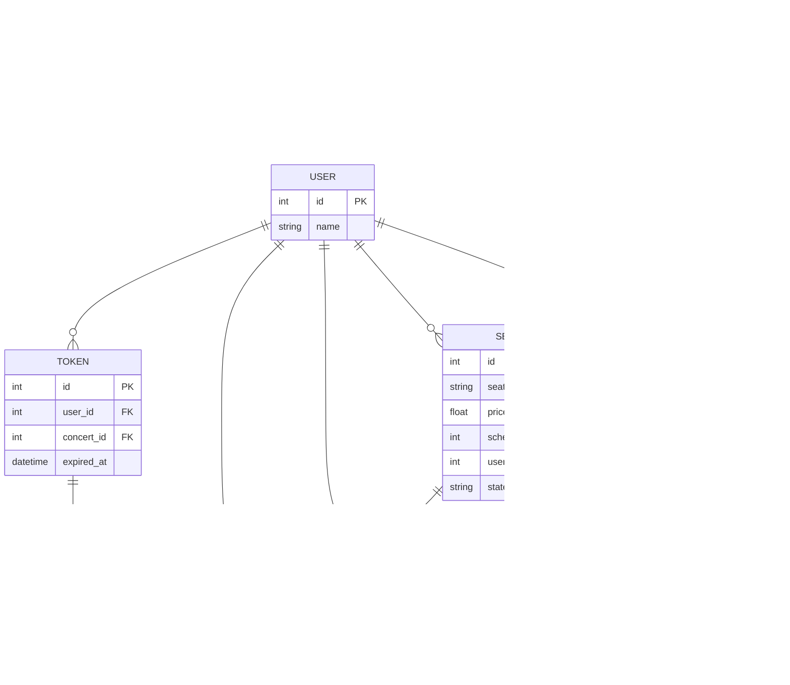

## erd 다이어그램

```mermaid
erDiagram
    USER {
        int id PK
        string name
    }

    POINT {
        int id PK
        int user_id FK
        int value
    }

    CONCERT {
        int id PK
        string name
    }

    CONCERT_SCHEDULE {
        int id PK
        int concert_id FK
        datetime start_date
        datetime end_date
        datetime play_date
    }

    SEAT {
        int id PK
        string seat_no
        float price
        int schedule_id FK
        int user_id FK
        string state
    }

    RESERVATION {
        int id PK
        int user_id FK
        int seat_id FK
        datetime expire_at
    }

    PAYMENT {
        int id PK
        int user_id FK
        int seat_id FK
    }

    TOKEN {
        int id PK
        int user_id FK
        int concert_id FK
        datetime expired_at
    }

    QUEUE {
        int id PK
        int token_id FK
    }

    USER ||--o{ POINT : ""
    USER ||--o{ SEAT : ""
    USER ||--o{ RESERVATION : ""
    USER ||--o{ PAYMENT : ""
    USER ||--o{ TOKEN : ""

    CONCERT ||--o{ CONCERT_SCHEDULE : ""

    CONCERT_SCHEDULE ||--o{ SEAT : ""

    SEAT ||--o{ RESERVATION : ""
    SEAT ||--o{ PAYMENT : ""

    TOKEN ||--o{ QUEUE : ""
```