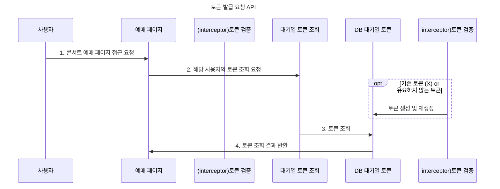
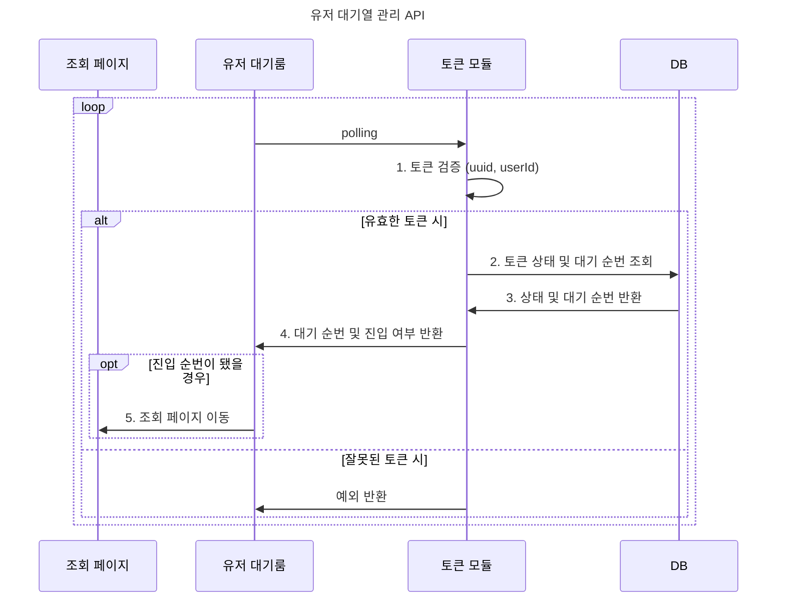
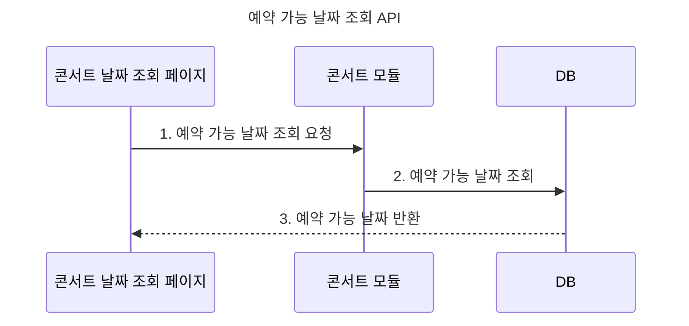
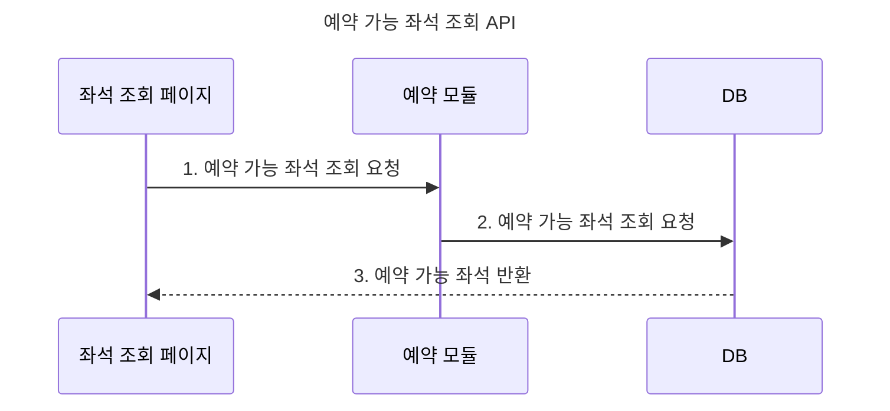
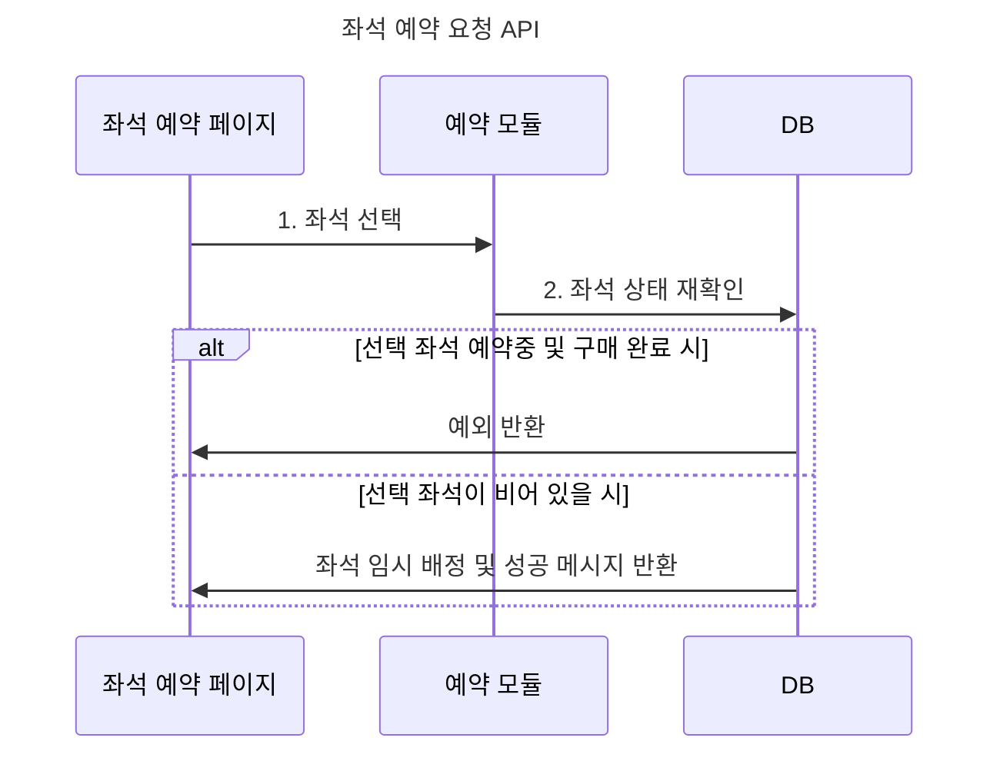
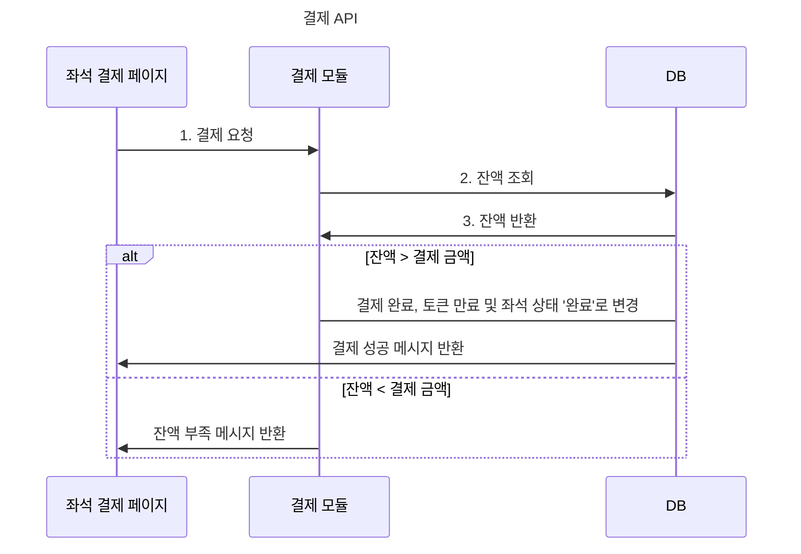
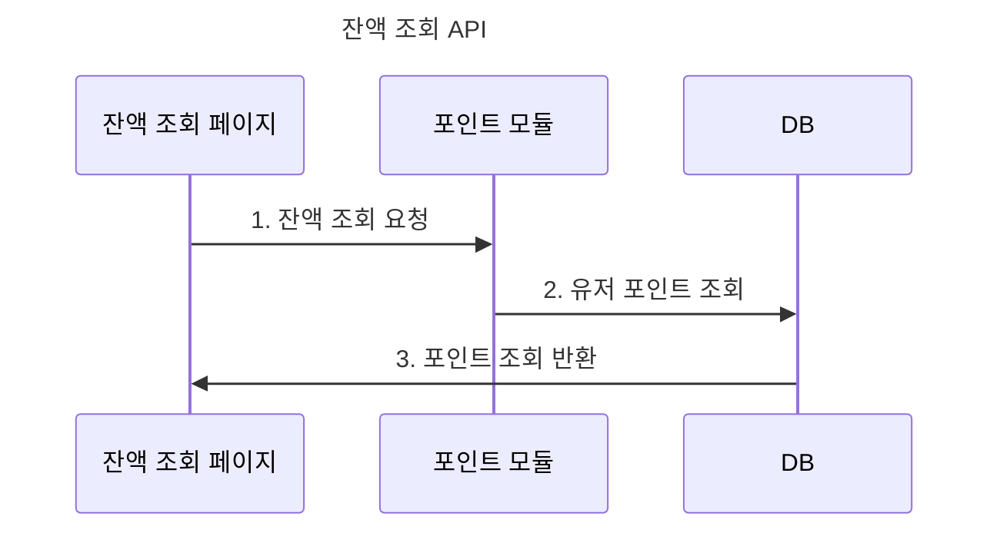
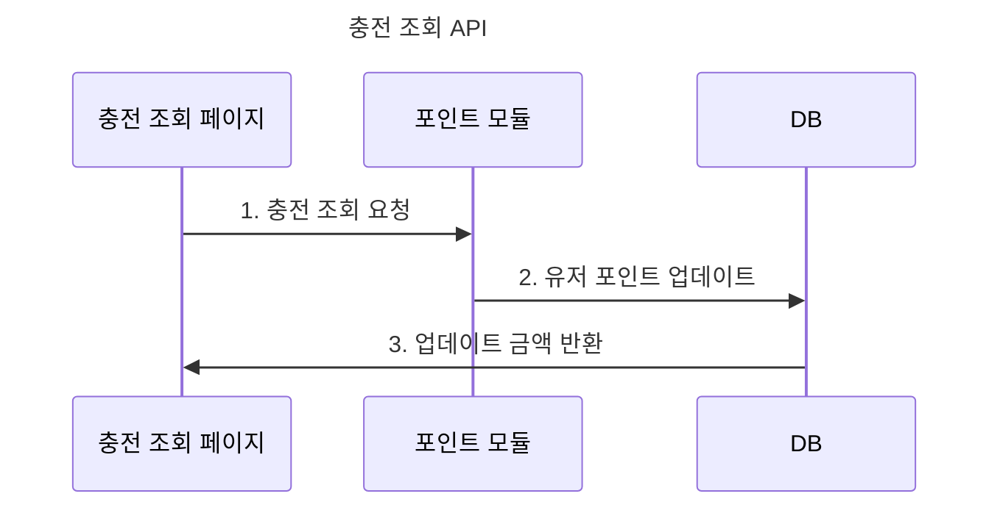

## 1. 사용자 대기열 토큰 발급

```mermaid
sequenceDiagram
    title 토큰 발급 요청 API

    participant 사용자
    participant 예매 페이지
    participant (interceptor)토큰 검증
    participant 대기열 토큰 조회
    participant DB 대기열 토큰

    사용자->>예매 페이지: 1. 콘서트 예매 페이지 접근 요청
    예매 페이지->>대기열 토큰 조회: 2. 해당 사용자의 토큰 조회 요청

    opt 기존 토큰 (X) or 유요하지 않는 토큰
        (interceptor)토큰 검증->>DB 대기열 토큰: 토큰 생성 및 재생성
    end

    대기열 토큰 조회->>DB 대기열 토큰: 3. 토큰 조회
    DB 대기열 토큰->>예매 페이지: 4. 토큰 조회 결과 반환
```

## 2. 유저 대기열 관리 API

```mermaid
sequenceDiagram
title 유저 대기열 관리 API

participant 조회 페이지
participant 유저 대기룸
participant 토큰 모듈
participant DB

loop 
유저 대기룸->>토큰 모듈:polling
토큰 모듈->>토큰 모듈:1. 토큰 검증 (uuid, userId)
  alt 유효한 토큰 시
    토큰 모듈->>DB:2. 토큰 상태 및 대기 순번 조회
    DB->>토큰 모듈:3. 상태 및 대기 순번 반환
    토큰 모듈->>유저 대기룸:4. 대기 순번 및 진입 여부 반환
    opt 진입 순번이 됐을 경우
      유저 대기룸->>조회 페이지:5. 조회 페이지 이동
    end
  else 잘못된 토큰 시
    토큰 모듈->>유저 대기룸:예외 반환
  end
end

```

## 3. 예약 가능 날짜 조회 API

```mermaid
sequenceDiagram
    title 예약 가능 날짜 조회 API

    participant 콘서트 날짜 조회 페이지
    participant 콘서트 모듈
    participant DB

    콘서트 날짜 조회 페이지->>콘서트 모듈: 1. 예약 가능 날짜 조회 요청
    콘서트 모듈->>DB: 2. 예약 가능 날짜 조회
    DB-->>콘서트 날짜 조회 페이지: 3. 예약 가능 날짜 반환
```

## 4. 예약 가능 좌석 조회 API

```mermaid
sequenceDiagram
    title 예약 가능 좌석 조회 API

    participant 좌석 조회 페이지
    participant 예약 모듈
    participant DB

    좌석 조회 페이지->>예약 모듈:1. 예약 가능 좌석 조회 요청
    예약 모듈->>DB:2. 예약 가능 좌석 조회 요청
    DB-->>좌석 조회 페이지:3. 예약 가능 좌석 반환
```

## 5. 좌석 예약 요청 API

```mermaid
sequenceDiagram

title 좌석 예약 요청 API


participant 좌석 예약 페이지
participant 예약 모듈
participant DB

좌석 예약 페이지->>예약 모듈:1. 좌석 선택
예약 모듈->>DB:2. 좌석 상태 재확인

alt 선택 좌석 예약중 및 구매 완료 시

DB->>좌석 예약 페이지:예외 반환
else 선택 좌석이 비어 있을 시

DB->>좌석 예약 페이지:좌석 임시 배정 및 성공 메시지 반환
end
```

## 6. 결제 API

```mermaid
sequenceDiagram
title 결제 API

participant 좌석 결제 페이지
participant 결제 모듈
participant DB

좌석 결제 페이지->>결제 모듈:1. 결제 요청
결제 모듈->>DB:2. 잔액 조회
DB->>결제 모듈:3. 잔액 반환

alt 잔액 > 결제 금액
  
결제 모듈->DB:결제 완료, 토큰 만료 및 좌석 상태 '완료'로 변경
  DB->>좌석 결제 페이지:결제 성공 메시지 반환
else 잔액 < 결제 금액
  결제 모듈->>좌석 결제 페이지:잔액 부족 메시지 반환
end
```

## 7. 잔액 조회 API

```mermaid
sequenceDiagram
title 잔액 조회 API

participant 잔액 조회 페이지
participant 포인트 모듈
participant DB

잔액 조회 페이지->>포인트 모듈:1. 잔액 조회 요청
포인트 모듈->>DB:2. 유저 포인트 조회
DB->>잔액 조회 페이지:3. 포인트 조회 반환

```

## 8. 충전 조회 API

```mermaid
sequenceDiagram
title 충전 조회 API

participant 충전 조회 페이지
participant 포인트 모듈
participant DB

충전 조회 페이지->>포인트 모듈:1. 충전 조회 요청
포인트 모듈->>DB:2. 유저 포인트 업데이트
DB->>충전 조회 페이지:3. 업데이트 금액 반환
```